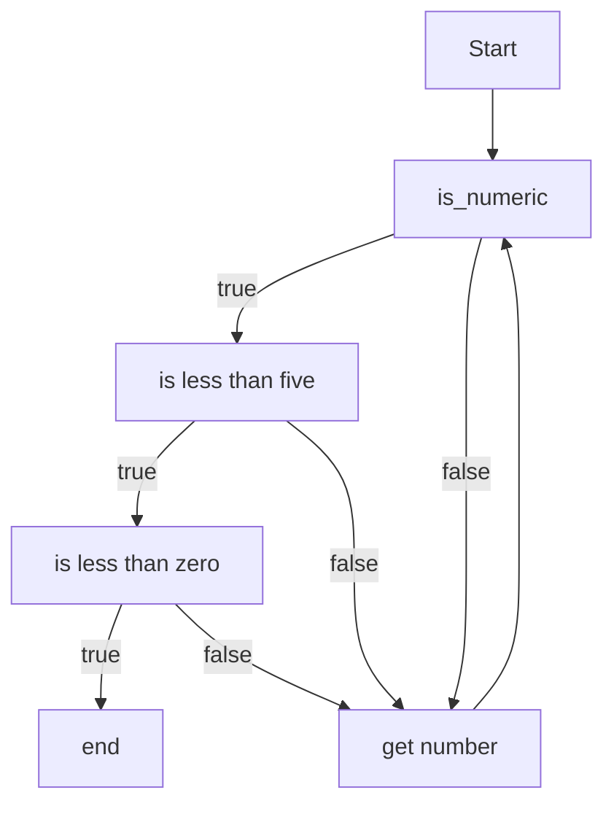

# Report

Please answer the questions below. Make sure to ask questions if you have them. 


For all these questions, it is recommended youthe python interpreter and try out the code.  You can also use the python visualizer to help you visualize the code.  You can find the visualizer here: [http://www.pythontutor.com/visualize.html#mode=edit](http://www.pythontutor.com/visualize.html#mode=edit)


1. Correct the following loop.
   ```python
   value = None
   while value == "quit":
       value = input("Enter a value or quit: ")
       print(value)
   ```
    ```python
    ## put your corrected code below this line
    value = None
    while value != "quit:"
       value = input("Enter a value or quit: ")
       print(value)

    ```

2. The above code uses a None value to initialize the input variable. This works because python can let a variable be multiple types, but in some languages, you would have to match the type. Assuming you had to match the type (str), what would be a good default input value, that could never cause the loop to not run at least once? Provide reasoning for your logic as there are multiple correct answers. With that said, there is one that is more 'standard' than the rest, so feel free to openly discuss options that come to mind (you do not have to come up with the standard answer, but try to!). 

I think that the best option here would be to initilize an empty string instead of using None. This would avoid the possibility of a null pointer exception if someohow value was attempted to be used at runtime. An empty string can also appended to easily because it is essentially an empty string object. I think conceptually it retains the emptyness of the variable without causing unexepcted behavior.  

3. Write a small loop that will keep repeating until someone enters a number greater than 0, and less than 5. It has to be
whole numbers (hint: look up .isnumeric() from the team activity).

   ```python
   num: str = ''
   while not (num.isnumeric() and int(num) < 5 and int(num) > 0):
        num = input("Please enter a whole number greater than zero and less than five")

   ```

4. Draw a flow diagram for your solution to #3



5. Looking back at homework #2, we actually had a type of 'loop' in the provided code (look near the main function). First copy the bit of code that causes the loop.
    ```python
    again = input("Run again (y or n)? ")
	if again.strip().lower() == 'y':
		main()  # discussion item: what does this do?		else:
		print("Good luck on the move!")
    ```
    Now: what would be some of the pros and cons of looping in such a way (think about 'frames' you see in the python visualizer)?

    The loop we had in main for the living temperatures was definitely something I had missed. It is a recursive loop where main was called to basically rerun the program. This would go on forever as long as the user continues to enter y to restart the program. Some advantages are the clean syntax, the loop condition is the input variable which makes it a very straightforward. Some unexpected issues could occur if the user is somehow unable to enter the correct keyword or character to terminate the loop. One of the dangers of this is that we have effectively a while loop without the while loop syntax meaning it is easy to misunderstand what the code is doing. 

6. Thinking about edge cases, it is very common to get an off-by-one (OB1) error with loops. 
   Create two test cases (just as examples/inputs) for the following code. They 
   should both be 'correct' cases, but one of them should uncover the error in the code.

   ```python
    def count_backwards(value: int) -> None:
        """ Counts from value to 0, printing even values until 10 (including 10), and 
        then odd values."""
       counter = value
       while counter >= 0:
          if counter > 10:
            if counter % 2 == 0:
                print(counter)
          else:
            if counter % 2 == 1:
                print(counter)
          counter -= 1
   ```

* Example test one:
   ```python
    count_backwards(11)
    ```
    > 10, 9, 7, 5, 3, 1

    This uncovers the error in the code because the docstring states that it is supposed to print even values until 10 including 10. We should fix it to:
    ```python
    if counter >= 10:
    ```

* Example test two:
    ```python   
    count_backwards(0)
    ```

    > None 

7. When thinking of these edge cases and OB1 errors, it is common to say one should testevery condition plus-minus 1. In your opinion, is this beneficial? Why or why not?

I think that this makes a lot of sense to do in certain circumstances. I think that the max expected input, above the max expected input, the minimum expected input, and below the minimum are the most important test cases. I would consider these to be the most important cases because generally this is where the logic of the program need special attention. Because of this I would say if the inputs of our program can be represented as x >= y <= z I would test x +- 1 and z +-1.

## Deeper Thinking

Reflection is a powerful tool that has been **repeatedly** documented to help computer scientists learn languages, concepts, and improve their problem solving skills. There is even research that shows CS majors who spend time reflecting often do better at technical interviews, and long term studies show those reflective students also tend to get higher paying jobs over time. It is also a great way to help you learn how to learn.

Take a moment to reflect on the design of jailbreak.py (just the one file). Was it a design you would have come up with given the problem? Did breaking concepts up into functions help as compared to one loop? Also take a moment to reflect on your development process in general. What are topics you need to work on? What are some topics you really enjoy?  You should write a paragraph reflection using *PROSE* (don't bullet point). We often return reflections that are bullet points, and there is a reason you should use prose as it forces you to consolidate and solidify your thoughts. 

The design of jailbreak.py was fairly straightforward once I took the time to really understand what was going on. Most of the important code was in main and the imports at the top of the file which were tools we had at our disposal. Having two separate functions the combo lock and pattern lock was something that made sense because although both things could have been done in the same function it made more sense for testing and clarity to separate the two functions. Making a separate function for breaking the pattern was not originally my idea, but as I started to write it I realized that it was complex and important enough to warrant its own function. I appreciated having a function to do this because I was able to test it in main and tweak it until all the x's were coming out correctly. I have been enjoying this approach to development a lot because it is very different from how I naturally would do things. The idea of building software around testing and writing out docstrings is a very methodical approach. I have found that it is faster, to my surprise, and is a more stress free experience. I definitely need to work on being more disciplined in these two areas because it often feels like a chore to do these things, but I recognize the value in it and am starting to see why it is worth the effort. 
