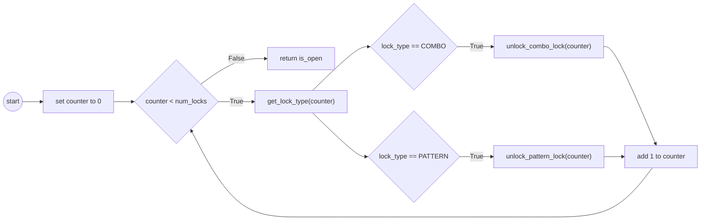

# Homework 04 - Escape from Jail

For this assignment, you will explore while loops in multiple ways, and expand upon your knowledge using functions. 

The premise for this assignment is inspired by the [Think Like a Coder](https://www.youtube.com/watch?v=KFVdHDMcepw&list=PLJicmE8fK0EgogMqDYMgcADT1j5b911or&index=2) Lessons by Alex Rosenthal, directed by Kozmonot Animation Studio. 

You are very much like Ethic in which you have been captured and need to break your way out of jail cells. To accomplish this task, you have been given a series of [Lock Tools](../src/lock_tools.py) that can help you give information about a lock - most notably based on the lock id (number), it will tell you the type of lock it is (Pattern based or Number/combo based), and if your guessed solution is correct. Thankfully, you can guess unlimited times, and the locks themselves either have only single digits or a single pattern type. 

## Provided Code

Looking through the provided code in [jailbreak.py](../src/jailbreak.py), you will find there are a number of items imported from [Lock Tools](../src/lock_tools.py)

```python
from lock_tools import COMBO, PATTERN, MAX_PATTERN_SIZE, check_solution, is_open, \
    get_lock_type, new_door, get_single_combo, get_single_pattern
```

Most all of these are for your use, the exception being new_door() which is used in 
the main() to generate a series of locks for a single door. What about the other items?

* COMBO - This is the string "COMBO". However, get_lock_type returns either "COMBO" or "PATTERN", so it is better to use the variable than the string as it allows the lock_tools.py file to determine what the string looks like. For example, if the string turned to "combo", your code would break if you don't use the variable `COMBO`.
* PATTERN - Same as COMBO, but for "PATTERN".
* get_lock_type(int) - gives you either COMBO or PATTERN based on the number / ID of the lock passed in. Locks IDs are simply $0..n-1$ with $n$ being the number of possible locks.
* check_solution(int, str or int) - You can pass in a possible solution (can be a string or an int) to check against a certain lock. If True is returned, you found the correct solution. 
* get_single_combo, get_single_pattern - these functions are there to help with interactive testing (see below). 

## Program Flow

The program has the following flow to it:

* main - gets a series of door (randomly generated) with locks on them.
  * for each door it calls open_door(int) where int is the number of locks on the door
* open_door - loops from 0 until n getting the type of the lock
  * based on the type of the lock calls unlock_combo_lock or unlock_pattern_lock
* unlock_combo_lock / unlock_pattern_lock keep searching until they find the solution respectively. 

### open_door Flow Chart

Here is a possible flow chart for `open_door(num_locks: int)`



> [!TIP]
> This is one of multiple loops for this project. Make sure to focus on trying
> to keep it as simple as possible. This project gets really difficult
> if you don't try to break it up!

### unlock_combo_lock(int)

The function unlock_combo_lock looks through all possible combinations. What you know is that the combinations are all greater than or equal to 0 and are whole numbers.

:fire: Task: Think through the pattern, and draw a flow chart for your loop inside of unlock_combo_lock. 

Once you are comfortable with the flow, code the function. Keep it simple!

#### Testing unlock_combo_lock (and test_pattern)

To make this more 'realistic' there is a lot of random generation of combinations 
in the assignment. While a real world issue, this also makes testing very difficult. Also, unlike in the past were most your functions are pure functions, these functions rely heavily on functions that can give variable results. As such, we have provided two functions to help you test interactively. 

To test interactively, make sure you do the following:

1. Highlight the imports in the file, and run them in the interactive window
2. Run `get_single_combo()` in the interactive shell.
   1. This will return information about the lock you are trying to 'solve'. 
3. Run `unlock_combo_lock(0)` in the interactive shell (the ID of a single lock)

You should be able to see by the return value if the two values match, and the lock was solved! 

You can repeat this process with the pattern lock, but use the functions respective of the pattern lock `get_single_pattern()` and `unlock_pattern_lock(0)`. Though with
pattern lock, you may have an intermediate function. 


> [!TIP]
> We suggest working up to this point in the assignment now! The pattern lock is
> harder, so good to make sure your assignment is working with a basic combo lock!

### Pattern Locks

Pattern Locks are a bit more complicated. Thankfully, the people who imprisoned you only know how to draw one pattern - a large "X" where the X is of varying sizes. 

Most notable, the patterns can be from nothing (`''`) to an X of dimensions 13 x 13. For example:

* size 3 - 
    ```
    x x
     x 
    x x
    ```
* size 5 -
    ```
    x   x
     x x 
      x  
     x x 
    x   x
    ```
* size 13 -
  ```
   x           x
    x         x 
     x       x  
      x     x   
       x   x    
        x x     
         x      
        x x     
       x   x    
      x     x   
     x       x  
    x         x 
   x           x
  ```
Each 'x' is equal in width and height using both spaces and small `x`'s to make up the large X. Meaning a 13x13 X, has 13 lines, and 13 total characters per line not including the new line `\n` character.

Thankfully, we know the following

1. Your only options are either 0(nothing), or odd numbers for the patterns (1, 3, 5 .. 13).
2. MAX_PATTERN_SIZE gives the highest possible pattern size (13). 

Building the X can be a challenge. As such we recommend the following actions.

#### Tips for unlock_pattern_lock

1. Write at least one separate function to build the X with size being the parameter. 
   1. This function you should test as you are writing it! 
   2. It may be easier to build a 'V' and figure out how to add the middle and bottom.
   3. Have a counter of where the 'x' goes that increments / decrements as you progress through the lines building them. 
2. Write unlock_pattern_lock calling this function changing the size with each call - until the solution size is found. Don't forget to call only odd numbers with 0 being a special
case. 

> [!WARNING]
> You need to do this via loops, and know it is possible to complete with just while loops. 
> This is also a bit of a mind twist, as you may need extra variables. 


## Overall
Coding this assignment has very few required functions to code. However, it is the type of assignment that if you tried to do it as one giant loop, it would be nearly impossible. Focus on what you need to do in each set and try to keep it simple. Loops can be hard as humans are often really bad at thinking via loops/incrementally. It just takes practice. 


## Report.md and README.md

:fire: **Task**: Answer the questions in the [Report.md](../Report.md) and [README.md](../README.md) files. 

One question will require you to draw a flowchart. You can upload the .png or other file when you submit your homework.

As always you are free to ask about the questions in MS Teams, including clarifications on the code. 


## Coding Practice
Looking at the coding [practice problems](https://github.com/CS5001-khoury/Resources/blob/main/PracticeProblems.md) in the class resources, you should ideally do a few
others on your own to get more practice coding.  However, you need to submit at least ONE (1) 
completed practice as its own python file (which means even if the coding practice had an online
form to fill out like codingbat, you need to copy your solution to a python file). 


## 📝 Grading Rubric

You need to submit the following files:

* [jailbreak.py](../src/jailbreak.py)
* Your Coding Practice file
* Flow charts included (unlock_combo_lock, and report one)
* [Report.md](../Report.md)
* [README.md](../README.md) (the one with your name in it)


### Rubric


1. Learning (AG)
   * unlock_combo_lock works
2. Approaching  (AG)
   * unlock_pattern_lock works
   * passes PEP8 style check
3. Meets  (MG)
   * Used loops to generate the pattern.
   * Includes required flow charts
   * Properly formatted docstrings exist for each function
   * Coding practice file provided
4. Exceeds  (MG)
   * Report questions answered properly
   * Report deeper thinking answered with some thought


AG - Auto-graded  
MG - Manually graded


### Submission Reminder 🚨
For manually graded elements, we only guarantee time to submit for a regrade IF you submit by the DUE DATE. Submitting late may mean it isn't possible for the MG to be graded before the AVAILABLE BY DATE, removing any windows for your to resubmit in time. While it will be graded, it is always best to submit by the due date, so you have full opportunity to improve your grade.