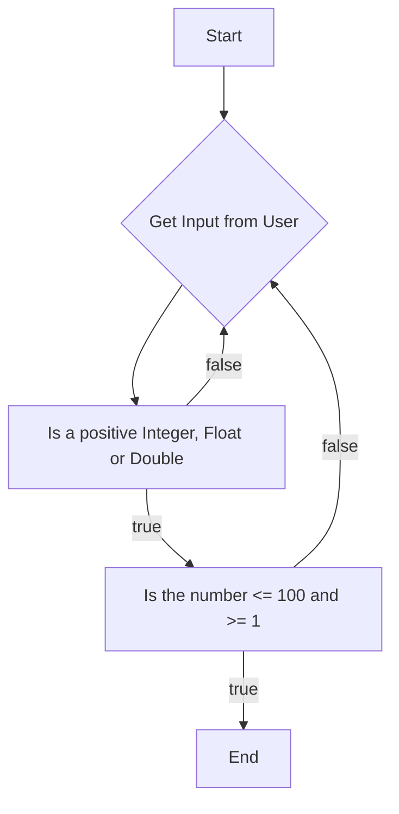

# Report

Please answer the questions below. Make sure to ask questions if you have them. 


For all these questions, it is recommended you open up IDLE or the python interpreter and try out the code.  You can also use the python visualizer to help you visualize the code.  You can find the visualizer here: [http://www.pythontutor.com/visualize.html#mode=edit](http://www.pythontutor.com/visualize.html#mode=edit)

1. Given the following code:
   ```python
   def check_valid(num):
       if num < 100:
           return True
       else:
           return False

   def main():
      number = int(input("Enter a number between 1 and 100: "))
      if check_valid(number):
          print("Valid")
      else:
          print("Invalid")
   ```
   a. Does the code properly check to see if the number is between 1 and 100?  If not, what is the problem?

   The method checks if user input is below 100 but it fails to check if the number is above 1. This means that if a user put in -10 the program print Valid even though -10 is not within 1 and 100. Both conditions need to be true for the number to be within this range. We also need to consider that if the user inputs 100 or 1 these are also within the range so we need to use the less than or equals operator to make sure those scenarios are accounted for as well.  

   b. If not, go ahead and re-write the check_valid function here. You will notice, that num is a parameter of the function, and something you can use within the function itself as a variable. 
   ```python
   def check_valid(num):
       if num <= 100 and num >= 1:
           return True
       else:
           return False
   ```


   c. Now let's take a moment. Define an *edge case* using your own words. You may need to do some research on edge cases (make sure to cite sources).

   I am very familiar with the concept of an edge case because it is an intuitive concept to me. When I think of an edge case I often think about how in video games games often have bugs around the edges of expected behavior. I often think about the many duplication glitches that are found simply from doing unintended things in a game. I view an edge case as simply something the programmer did not intend, like if I ask for a number input in python and someone writes the word cat instead of a valid integer. 

   d. Now let's say you are writing a function to test if check_valid is actually correct! We can start with the following code
   ```python
   def test_check_valid():
      passed = 0
      if check_valid(50):
          passed += 1
      if check_valid(100):
          passed += 1
      if check_valid(101) == False:
          passed += 1

      print(f"Passed: {passed} of 3 tests")
   ```
   Does the code above test all the *edge* cases? If not, what is missing? 

    The code does check to make sure the number is within the range, but it misses checking edge cases such as strings or large numbers that will cause errors. There should be some validation that the input is a number because a non number input could crash the program. If I add the test     
    ```python
    if check_valid("3" == False):
        passed+=1
    ```
    Python gives us a type error, so clearly we have not dealt with the edge case of an accidental string input. 

   > Suggestion: Go ahead and copy the above code (both blocks) into a file, then load it into idle. You can run the test_check_valid() by the built in interrupter once the file is loaded. 

2. Draw a flowchart for a function that checks to make sure a number is between the range 1 and 100. Go ahead and include it in your submission. In your own words, how does the flow chart help you see edge cases?


This flowchart forces you to break the problem down into step by step. When I was thinking through the process of validating user input I was able to list out the potential edge cases logically. By thinking about the code in a top-down manner I was able to determine the correct order of steps. 


3. Now thinking about edge cases, temp_guess.py, what would be the edge cases for the application? (btw, these are the same cases you should test your code with before submitting your code)

The first edge case I thought of was when no cities fit within the range of temperatures given. The simple fix I found was to check if the length of the string was zero before returning it and concatenating unknown to it. The next edge case was if users entered the exact same temperature as one of the city temperature. The fix for this was to use the <= and >= operator to cover that edge case. Finally I also used a try except to catch any errors that might occur of someone ended up putting a non integer, double, or float as input. I also used a while loop to re-prompt the user until a valid input is received. 


> [!NOTE]
> **Test Functions?**   
> In industry, test-driven-development (TDD) has teams write tests *first* and then they write their code. You will explore this more later in the semester and then follow this process strictly in 5004. As you progress, make sure to think about how you can test your code in addition to writing your code. The process may feel slow now, but it will save you time in the long run. 


## Deeper Thinking

Assume you are writing a guessing game application in which the computer generates a random number, and you get to keep guessing until you find the number. You know the number is between 1 and 100.

* Can you come up with an algorithm to guess the correct number? As you have as many chances as possible, it is alright to do the simplest case. 

If I were to make an algorithm as simple as possible and guaranteed to arrive at the correct number I would just try from 1 to 100 until the correct number is found. This could take as many as 100 guesses, but it could also be as quick as 1 guess. Both of these scenarios are highly unlikely, and if I had to guess about the probability it would probably average out to around 50 guesses each time. This isn't terrible not, but increases this probably won't be a scalable solution.

* Assuming there are 100 possible numbers, which are ordered from 1 to 100, how many guesses would it take in the worst case?

The worst case would be 100 guesses if the number happens to be 100. If starting from 100 and counting down the worst case would be 1 which would also take 100 guesses.

* Can you figure out an algorithm that would take less guesses in the worst case and still come up with the same answer?

With the number as a random number with no help from the program it wouldn't really be possible to know whether a guess is less than or greater than the number. With a little bit of feedback from the program i.e. telling us if the number is greater or less than our guess. With this change we can start at 50 and if the number is less we know know it is between 1 - 50 narrowing down potential numbers in half. Then if we guess half of 50, 25, we can narrow the search down to between 25 - 50 or 0 - 25. This would cut our search time significantly, and we are guaranteed to find our number much quicker. I thought of this because of the address book example which reminds me of how we dictionaries today when looking for a word. Since we know they are organized by alphabetic order we can start our search in the middle and go from there to find the right grouping of letters. 

  * This is challenging! do the best you can, talk with others, and no need to have the correct answer at this time - just any answer will be valid. We are more interested in your thought process.
    For example, did you try a few algorithms out on paper? Ask yourself the worst case and best case for finding the number?

    The worst case seems to be around 7 guesses, but there are some kinks to work out when it comes to numbers that don't divide by two evenly. The floor operator could be used to divide by two and round down.

    <50 
    <25
    <12
    <6
    <3
    <2
    Number is 1


  * For reference, there is a fast algorithm that is based on one of the oldest documented search algorithms in history - back to the Romans talking about how to use an address book for Rome. 
  