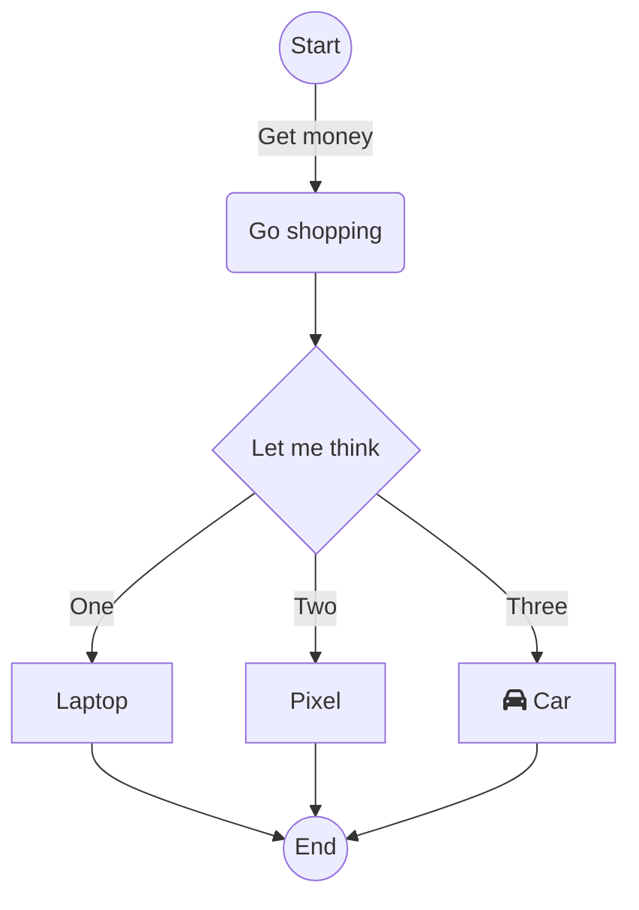

# Homework 02 - Introduction to Logic

For this module, we will explore both variable types, logic and building flowcharts. You may want to read through the entire assignment (including the Additional Resources) 
before getting started on this one, as there are some tips and tricks that may help you out.


## Location Guessing Application

For this task, you will explore variable types, client `input()`, and boolean logic. For this, you will use [temp_guess.py](../src/temp_guess.py). The application is broken up into four functions, following the divide-conquer-glue way of approaching problems. 

* **main()** - this function is provided for you. You should read through and understand it, as it is the 'glue' of the application combining the other results of the other functions.
* **get_number(prompt: str) -> int:** prompts the client using prompt and returns a whole number.
* **check_lower(first: int, second: int) -> bool:** returns True if first is lower or equal to second.
* **get_cities(low: int, high: int) -> str:** this is the heart of the application. Based on low and high temperatures being passed into the function, it builds a string of possible cities to live in with each city being separated by the newline (\n) character. 

### Final Application
The final application suggests a location to live based on conditions.

Given the following chart

| City | High | Low |
| :-- | :--: | :--: |
| Beijing | 33 | -8 |
| Boston | 28 | -7 |
| Honolulu | 32 | 13 |
| San Francisco | 27 | 6 |
| Vancouver | 24  | 2 |

* The client will provide two numbers, a high and low number. 
  * They can be in any order.
* Based on the high and low, will provide recommendations based on locations that fall within the range provided. 
* If a condition can't be met, it will print Unknown. 
 
For example, 
```text
Enter a temperature: 28
Enter a second temperature: -10
Boston
San Francisco
Vancouver
```

```text
Enter a temperature: 12
Enter a second temperature: 35
Honolulu
```

```text
Enter a temperature: 0
Enter a second temperature: 30
San Francisco
Vancouver
```

```text
Enter a temperature: 0
Enter a second temperature: 20
Unknown
```

### 👉🏽 Your Tasks
* Build a flowchart for get_cities. Really think about your conditions. You need to provide the flowchart as an image (see below for some resources).  
* Complete the get_number, check_lower, and get_cities - you will find get_cities is the hardest by far, so make sure you think about your flowchart and the various conditions. It is very easy to get it 'backwards' or make it more complicated than it needs to be. 

> [!TIP]
> When working on your functions, write the function and use 'run in interactive window' in VS Code. 
> You can then test the function with various parameters once it is loaded. However, you need to keep
> highlighting the function and rerunning as you make changes. It is also possible to make the 
> function only work for a couple cities, then keep adding more cities until it works in all cases. 

## Report.md and README.md

👉🏽 **Task**: Answer the questions in the [Report.md](../Report.md) and [README.md](../README.md) files. 

One question will require you to draw a flowchart. You can upload the .png or other file when you submit your homework.

As always you are free to ask about the questions in MS Teams, including clarifications on the code. 


## Coding Practice
Looking at the coding [practice problems](https://github.com/CS5001-khoury/Resources/blob/main/PracticeProblems.md) in the class resources, you should ideally do a few
others on your own to get more practice coding.  However, you need to submit at least ONE (1) 
completed practice as its own python file (which means even if the coding practice had an online
form to fill out like codingbat, you need to copy your solution to a python file). 

> [!TIP]
> It is often good to have a moduleX_coding_practice.py file that you have all your 
> solutions you work on for the single module (example: [module02_coding_practice.py](../src/module02_coding_practice.py)). Include a link to 
> the resource as a comment above each solution, and you can then go back and 
> review your code in the future. Note: you do not HAVE to follow this format, but it is
> highly recommended. It is HIGHLY recommended you do one coding practice a night throughout
> the week (from any module).


## 📝 Grading Rubric

You need to submit the following files:

* [temp_guess.py](../src/temp_guess.py)
* Your flowchart for get_cities
* Your flowchart for the Readme.md question
* Your Coding Practice file
* [Report.md](../Report.md)
* [README.md](../README.md) (the one with your name in it)


### Rubric


1. Learning (AG)
   * check_lower() works on a variety of inputs.
2. Approaching  (AG)
   * get_cities() works on variety of inputs.
   * Code follows recommended style suggestions.
3. Meets  (MG)
   * Flowchart is correct for both get_cities
   * Readme.md is filled out
   * Coding practice is provided
4. Exceeds  (MG)
   * Report.md question 1, 2, 3 are correct
   * Report.md flowchart is correct
   * Report.md deeper thinking is answered
     * Does not have to be correct, but does have to be provided and thoughtful.  


AG - Auto-graded  
MG - Manually graded

> [!IMPORTANT]
> You will see that there are only 2 autograded points, and 2 manually graded points. As a reminder,
> the manual graded won't happen until after you pass the autograder. A 2(ag) and 2 (mg) split
> will be more common for assignments as we move forward. 

### Submission Reminder 🚨
For manually graded elements, we only guarantee time to submit for a regrade IF you submit by the DUE DATE. Submitting late may mean it isn't possible for the MG to be graded before the AVAILABLE BY DATE, removing any windows for your to resubmit in time. While it will be graded, it is always best to submit by the due date, so you have full opportunity to improve your grade.

## 📚 Additional Resources

This section just defines some additional help resources incase you need them

### `input()` 
`input(val)` is a function that requests client input, and returns the value to store in a variable. There are a fair number of resources on it online that are worth looking up. However, a quick reference.

```python
name = input("Enter your name: ")  
```
Notice the parts, between the parenthesis is a prompt that will be printed to the screen. You have to be exact which is why the space is there. The answer to what the client entered needs to be stored in a variable, so thus name gets the answer. From that point on, name is used like any other variable.

```python
## assume someone entered Ada to the prompt
print(f"Welcome, {name}!")
```
Will print 
```text
Welcome, Ada!
```
>Important!  
The thing to watch for with `input()` is that it will **only** return strings! As such, if you want a number, you will need to convert the string to the value using `int(val)` or `float(val)`.


### Drawing flowcharts

You are free to just draw a flowchart on a piece of paper and take a picture. There are a fair number of tools programmers use to draw flowcharts. 

* [LucidChart](https://www.lucidchart.com/) 
* [Draw.io](https://www.draw.io)
* [Visio](https://www.office.com/launch/visio) - which usually costs money, but you have access to it through your NUE office account

However, a more recent trend has been to use [mermaid.js](https://mermaid.js.org/intro/). It is away to use a markdown like language to include mermaid directly into markdown files (like your readme), docstrings, or websites. To make it easier, they have a [live editor](https://mermaid.live/edit)

The following is written in text, and displays as an image thanks to mermaid.


* example pulled from their example with the live editor. 

> Important!  
> If you end up using mermaid, please still include a PNG of your flowchart.   
> Gradescope doesn't automatically show it, and the PNG is what the TAs will grade. There are multiple ways to do that. 
> Using the live editor, you can download the PNG, or there are some command line tools if you feel challenged. 
> 
