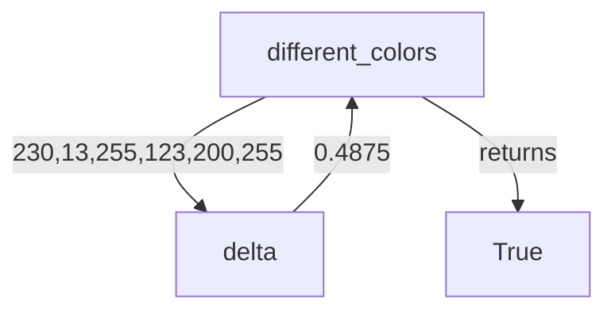
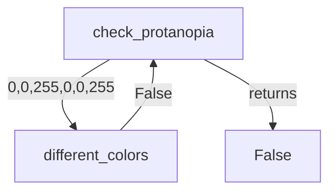
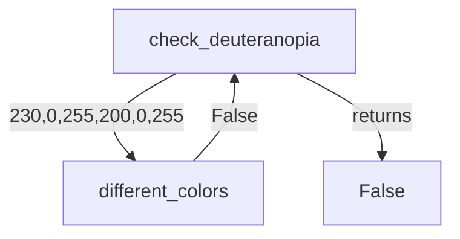
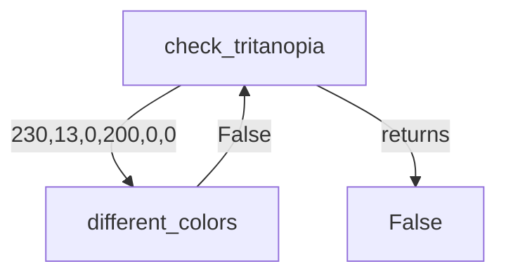

# Color Tester Design Document

The following document loosely presents a design for Color Tester.
Each function presented is required.

## Functions Required
You are required to implement from scratch, including the function call the following functions. You do not 
have to do type hints, but using in the definition so you know what is being passed into each function and 
what type should be returned.

* different_colors(int, int, int, int, int, int) -> bool
* check_protanopia(int, int, int, int, int, int) -> bool
* check_deuteranopia(int, int, int, int, int, int) -> bool
* check_tritanopia(int, int, int, int, int, int) -> bool
* rgb_to_hex_protanopia(int, int, int) -> str
* rgb_to_hex_deuteranopia(int, int, int) -> str
* rgb_to_hex_tritanopia(int, int, int) -> str
* get_fails(int, int, int, int, int, int) -> str

### Provided functions
The following functions are provided in [color_tester.py](../color_tester.py) and should not be changed.
* rgb_to_hex(int, int, int) -> str - Provided
* delta(int, int, int, int, int, int) -> float - Provided

## Function Definitions

### different_colors

Compares two color RBG values to see how different they are.  Does
not convert, only compares.

#### Args:
* red_one (int): a color range between 0 and 255 representing the red for the first color
* green_one (int): a color range between 0 and 255 representing the green for the first color
* blue_one (int):a color range between 0 and 255 representing the blue for the first color
* red_two (int): a color range between 0 and 255 representing the red for the second color
* green_two (int): a color range between 0 and 255 representing the green for the second color
* blue_two (int): a color range between 0 and 255 representing the blue for the second color

#### Returns:
True if the difference defined by `delta` is greater than `MIN_DIFFERENCE`

#### Flow Diagram:
Assume different_colors is called with (230,13,255) and (123,200,255):

### check_protanopia
Compares two RBG values checking to see if when the colors are seen
by someone with protanopia, they are to similar. 

> Protanopia is when there is 0 red and greens and only blues, so
> when comparing, all colors become their blue value only. 

#### Args
* red_one (int): a color range between 0 and 255 representing the red for the first color
* green_one (int): a color range between 0 and 255 representing the green for the first color
* blue_one (int):a color range between 0 and 255 representing the blue for the first color
* red_two (int): a color range between 0 and 255 representing the red for the second color
* green_two (int): a color range between 0 and 255 representing the green for the second color
* blue_two (int): a color range between 0 and 255 representing the blue for the second color

#### Returns
boolean: returns False if the colors are too similar when someone has protanopia

#### Flow Diagram
check_protanopia is called with (230,13,255) and (123,200,255):

### check_deuteranopia

Follows the same design as check_protanopia, but instead
of checking for protanopia checks colors with 
deuteranopia. 

#### Args
* red_one (int): a color range between 0 and 255 representing the red for the first color
* green_one (int): a color range between 0 and 255 representing the green for the first color
* blue_one (int):a color range between 0 and 255 representing the blue for the first color
* red_two (int): a color range between 0 and 255 representing the red for the second color
* green_two (int): a color range between 0 and 255 representing the green for the second color
* blue_two (int): a color range between 0 and 255 representing the blue for the second color

#### Returns
boolean: returns False if the colors are too similar when someone has deuteranopia.

> Deuteranopia: Defined as when someone looses all greens in an RGB value scheme

#### Flow Diagram
check_deuteranopia is called with (230,13,255) and (200,200,255): 

### check_tritanopia
Follows the same design as check_protanopia, but instead
of checking for protanopia checks colors with 
tritanopia. 

> Tritanopia is when someone sees only red and green values of an RGB color scheme.

#### Args
* red_one (int): a color range between 0 and 255 representing the red for the first color
* green_one (int): a color range between 0 and 255 representing the green for the first color
* blue_one (int):a color range between 0 and 255 representing the blue for the first color
* red_two (int): a color range between 0 and 255 representing the red for the second color
* green_two (int): a color range between 0 and 255 representing the green for the second color
* blue_two (int): a color range between 0 and 255 representing the blue for the second color

#### Returns
boolean: returns False if the colors are too similar when someone has tritanopia

#### Flow Diagram
check_tritanopia is called with (230,13,255) and (200,200,255):

### rgb_to_hex_protanopia
    
Converts RGB color values to hexadecimal representation for individuals with protanopia color blindness.

> Reminder: Protanopia is when there is 0 red and greens and only blues

#### Args:
  * red (int): The red component of the RGB color.
  * green (int): The green component of the RGB color.
  * blue (int): The blue component of the RGB color.

#### Returns:

str: The hexadecimal representation of the RGB color, adjusted for protanopia color blindness.

### rgb_to_hex_deuteranopia
    
Converts RGB color values to hexadecimal representation for individuals with deuteranopia color blindness.

Reminder: Deuteranopia is when there is 0 green values 

#### Args:
  * red (int): The red component of the RGB color.
  * green (int): The green component of the RGB color.
  * blue (int): The blue component of the RGB color.

#### Returns:

str: The hexadecimal representation of the RGB color, adjusted for deuteranopia color blindness.

### rgb_to_hex_tritanopia
    
Converts RGB color values to hexadecimal representation for individuals with tritanopia color blindness.

> Reminder: Tritanopia is when there is 0 blue values 

#### Args:
  * red (int): The red component of the RGB color.
  * green (int): The green component of the RGB color.
  * blue (int): The blue component of the RGB color.

#### Returns:

str: The hexadecimal representation of the RGB color, adjusted for tritanopia color blindness.

### get_fails

Returns a list of colorblindness if the colors fail. The tests are checked in order of 
* Protanopia
* Deuteranopia
* Tritanopia

If they fail, they are added to a return string with a new line character separating them. 

If empty string is returned, it is assumed the color is fine.  

## Args:
* red_one (int): a color range between 0 and 255 representing the red for the first color
* green_one (int): a color range between 0 and 255 representing the green for the first color
* blue_one (int):a color range between 0 and 255 representing the blue for the first color
* red_two (int): a color range between 0 and 255 representing the red for the second color
* green_two (int): a color range between 0 and 255 representing the green for the second color
* blue_two (int): a color range between 0 and 255 representing the blue for the second color

## Returns:
str: A string of names blindness types separated by \n

> [!TIP]
> This combines what you are learning in module 02 and module 03. Keep the statement simple 
> concatenating the above three options onto the string before returning. Review
> Homework 02 if you need a reminder on that. 

## Design Suggestions

This is the type of application that it helps to build from the "inside" out. Two functions are already given to you. `delta(int,int,int,int,int,int)` and `rgb_to_hex(int,int,int)`. You should use these methods to build the other methods.

For example, you could build `different_colors` first, and then use that to build `check_protanopia`, `check_deuteranopia`, and `check_tritanopia`. 

[test_color_tester.py](../tests/test_color_tester.py) is a file that you can add your tests to. You can and should uncomment the provided tests after you finish each function (don't wait until the end)!

> [!TIP]
> If you want to write your own tests, follow the format of the other ones including starting the function
> name with test_whatever. Be careful of the  indent. They are all intentionally indented in to signify 
> they belong to the UnitTest Object. `self.assertEquals(val1, val2)` is how you compare two values in a 
> unit test. You do not have to do this at this point, but it is helpful, as you will eventually be 
> writing your own unittests. 

